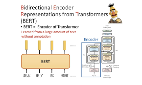

# 1 引言

BERT模型（Bidirectional Encoder Representations from Transformers）是一种在自然语言处理（NLP）领域具有深远影响的模型。李沐老师在2021年发布的视频中曾经说到：“如果将自然语言处理过去三年的文章按照重要性做排序的话，你把BERT排到第二的位置，那么很难有另外一篇论文能够名正言顺地排在第一的位置。”虽然现在距离2021年已经过去三年了，近几年自然语言处理领域也有了像ChatGPT这样更加“轰动级”的成果，但对于我们NLPer来说，BERT仍然是入门必读系列。

## 1.1 技术背景
BERT的出现是基于深度学习在NLP领域的快速发展。在BERT之前，已经有许多预训练语言模型，如ELMo和GPT，它们展示了预训练模型在NLP任务中的强大性能。然而，这些模型通常**基于单向的上下文信息**，即只考虑文本中的前向或后向信息，这限制了它们对文本的全局理解。BERT旨在通过引入**双向上下文信息**来解决这一问题，从而更准确地表示文本中的语义信息。

## 1.2 模型原理
BERT是一种基于Transformer架构的双向语言表示模型。它通过对海量文本数据的预训练，学习得到丰富的上下文表示，然后在下游任务上进行微调，实现极高的性能。BERT被开发为一个深层双向模型，它能够从输入序列的最初层一直到输出层有效地捕捉到目标单词周围的全方位上下文信息。

## 1.3 模型结构
BERT的结构基于Transformer编码器（Encoder）部分，完整的BERT模型包括一个**词嵌入层**、**多层的Transformer Encoder**，以及用于特定任务的输出层（映射层）。

- **Input**：BERT使用三种嵌入向量的组合作为输入表示，包括Token Embedding（词嵌入）、Segment Embedding（片段嵌入）和Position Embedding（位置嵌入）。这三种嵌入相加，BERT就能为每个输入词生成一个综合表示，这个表示同时蕴含了词本身的含义、它在句子中的角色（例如，属于哪个句子）以及它在句子中的位置信息。
- **Transformer Encoder**：BERT的核心部分是由多个堆叠的Transformer编码器组成。每个编码器层都包含多头自注意力机制（Multi-Head Self-Attention）和前馈神经网络（Feed-Forward Neural Network），并通过层归一化和残差连接进行稳定和优化。如下图所示:

图1 Transfomer Encoder 示意图

## 1.4 训练过程
BERT的训练过程包括预训练和微调两个阶段。

- **预训练**：在预训练阶段，BERT使用大量的无标签语料进行训练，通过**Masked Language Model(MLM)**和**Next Sentence Prediction(NSP)**这两个任务来学习语言的表示。MLM任务要求模型预测被mask掉的token，而NSP任务则要求模型判断两个句子是否连续。
- **微调**：在微调阶段，BERT可以针对特定的任务进行训练，以适应不同的应用场景。通常，只需要在Transformer的输出之上添加一个与任务相关的输出层，并进行少量的训练即可。
## 1.5 应用场景
BERT模型广泛应用于各种自然语言处理任务，如文本分类、情感分析、命名实体识别、翻译和问答系统等。由于BERT模型采用了Transformer架构和自注意力机制，可以有效地捕捉文本中的语义信息，因此在许多任务中表现出了出色的性能。

# 参考文献
[1] [Bert论文地址: BERT: Pre-training of Deep Bidirectional Transformers for
Language Understanding](https://arxiv.org/abs/1908.08962 )  \
[2] [李沐讲AI_Bert](https://www.bilibili.com/video/BV1PL411M7eQ/?spm_id_from=333.337.search-card.all.click&vd_source=a7a5ff2f9d1f5a8f5e83d4a2d2ed8fb0)
